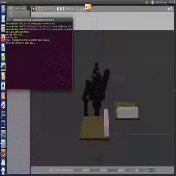
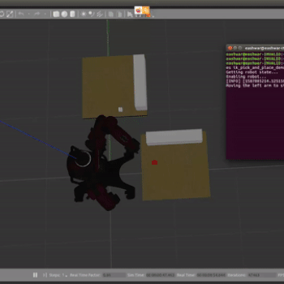

## Baxter Arm Path planning

### Overview
In this project, we picked and placed an object whilst avoiding the obstacles on the table using Baxter in simulated environment. There are two blocks, one on each table which are red and white in colour. Each block should be picked from its current table and placed safely on the other table, starting with the red block. 

### Pre-requisites required
1. ROS
2. Gazebo
3. Baxter simulator
4. Python version - 2.7
5. Rviz

### Packages used
1. Move-it package

### Library used
1. Open Motion Planning Library

### Run code
First we need to launch baxter arm in gazebo. 
```
cd ros_ws
catkin_make
source devel/setup.bash
```
Launching the Baxter simulator
```
./baxter.sh sim
roslaunch baxter_gazebo baxter_world.launch
```
Now open a new terminal and run the following commands
```
cd ros_ws
source devel/setup.bash
 rosrun baxter_sim_examples ik_pick_and_place_demo.py
```

### Sample Output

